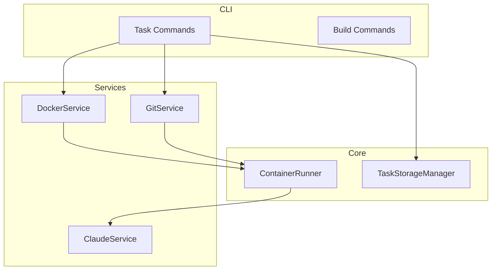

# Task 5 – Add Architecture Documentation & Diagrams

**Problem**
The project lacks a centralised architectural overview. New contributors must read the source code to understand interactions between CLI, core services, models, and external dependencies. Clear documentation accelerates onboarding and reduces architectural drift.

**Goal**
Produce up-to-date, visual and textual documentation of the system's architecture and make it easily accessible.

**Proposed Deliverables**
1. **`docs/architecture_overview.md`** – high-level description of application layers (CLI, Services, Core, External).
2. **Component diagram** – Mermaid chart embedded in doc to illustrate module boundaries and data flow.
3. **ADR (Architecture Decision Records) template** plus first ADR documenting the decision to adopt the new service layer (Task 3).
4. **`CONTRIBUTING.md`** section linking to architecture docs.

**Suggested Mermaid Example**

**Acceptance Criteria**
- Docs live under `docs/` and render correctly on GitHub.
- Diagrams render without additional plugins.
- ADR template exists; first ADR committed.
- A reader can grasp system architecture within 10 minutes using the docs. 