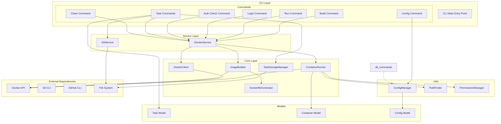

# Claude Container Architecture Overview

## Introduction

Claude Container is a Docker-based container management system designed to run Claude Code in isolated environments. This document provides a comprehensive overview of the system architecture, component interactions, and design decisions.

## System Overview

The application follows a layered architecture pattern with clear separation of concerns:

1. **CLI Layer**: User-facing command-line interface
2. **Service Layer**: Business logic and orchestration  
3. **Core Layer**: Low-level Docker and container operations
4. **Models Layer**: Data structures and configuration
5. **Utils Layer**: Cross-cutting concerns and helpers

## Architecture Diagram

## Component Descriptions

### CLI Layer (`claude_container/cli/`)

The CLI layer provides the user interface through Click-based commands:

- **Main Entry Point** (`cli/main.py`): Registers all available commands
- **Command Modules** (`cli/commands/`): Individual command implementations
  - `build.py`: Container image building
  - `run.py`: Execute commands in containers
  - `login.py`: Interactive authentication
  - `auth_check.py`: Verify authentication status
  - `task/`: Task management subcommands
  - `config.py`: Configuration management
  - `clean.py`: Cleanup operations

### Service Layer (`claude_container/services/`)

The service layer encapsulates business logic and coordinates between CLI and Core:

- **DockerService** (`docker_service.py`): High-level Docker operations
  - Container lifecycle management
  - Image building and management
  - Volume and network coordination
  
- **GitService** (`git_service.py`): Git repository operations
  - Branch management
  - Commit operations
  - GitHub integration via CLI

### Core Layer (`claude_container/core/`)

The core layer handles low-level operations and Docker API interactions:

- **ContainerRunner** (`container_runner.py`): Unified container execution
  - Consistent volume mount configuration
  - Environment variable management
  - Interactive and non-interactive execution modes
  
- **DockerClient** (`docker_client.py`): Docker API wrapper
  - Direct Docker daemon communication
  - Container and image operations
  
- **DockerfileGenerator** (`dockerfile_generator.py`): Dynamic Dockerfile creation
  - Template-based generation
  - Environment-specific configurations
  
- **TaskStorageManager** (`task_storage.py`): Task persistence
  - JSON-based storage
  - Task state management
  
- **ImageBuilder** (`image_builder.py`): Docker image construction
  - Build context preparation
  - Multi-stage build support

### Models Layer (`claude_container/models/`)

Data models using Pydantic for validation:

- **Task** (`task.py`): Background task representation
- **Container** (`container.py`): Container configuration
- **Config** (`config.py`): Application configuration

### Utils Layer (`claude_container/utils/`)

Cross-cutting utilities:

- **ConfigManager** (`config_manager.py`): Configuration file handling
- **PathFinder** (`path_finder.py`): Path resolution and validation
- **PermissionsManager** (`permissions_manager.py`): File permission management

## Data Flow

### Synchronous Command Execution

1. User invokes CLI command
2. Command validates input and calls appropriate service
3. Service orchestrates core components
4. Core components interact with Docker API
5. Results returned through service to CLI
6. CLI formats and displays output

### Asynchronous Task Execution (Planned)

1. User submits task via CLI
2. Task stored via TaskStorageManager
3. Daemon picks up task
4. Container spawned with task context
5. Claude Code executes task
6. Results saved and PR created if configured
7. User notified of completion

## Key Design Decisions

### Unified Container Configuration

All container executions use `ContainerRunner` to ensure consistent:
- Volume mounts (workspace, authentication, git config)
- Environment variables
- Working directory setup
- User permissions

### Service Layer Abstraction

The service layer provides:
- Simplified API for CLI commands
- Business logic encapsulation
- Error handling and validation
- Transaction-like operations

### Interactive vs Non-Interactive Execution

- Interactive commands (login, shell) use subprocess for proper TTY
- Non-interactive commands use Docker SDK for better control
- Both modes share the same configuration

## Security Considerations

- Authentication files mounted read-write but isolated
- SSH and Git configs mounted read-only
- Container runs as non-root user
- Secrets never logged or exposed

## Future Enhancements

1. **Daemon Mode**: Background task processing
2. **Task Queue**: Priority-based task scheduling  
3. **Web UI**: Optional web interface
4. **Plugin System**: Extensible command architecture
5. **Cloud Integration**: Remote container execution